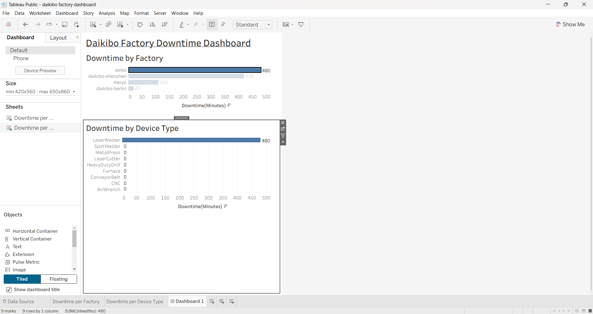

# Daikibo Factory Downtime Analysis

## 📊 Project Overview

This project analyzes factory telemetry data to identify downtime patterns across Daikibo factories and device types.

The analysis was performed using Tableau to identify factories and machines contributing the most to operational downtime.

## 🎯 Objectives

- Analyze downtime across different factories
- Identify factories with the highest downtime
- Compare downtime across device types
- Identify machines contributing to operational downtime
- Build a clear Tableau dashboard

## 📈 Dashboard

## 🔍 Key Insights

- Seiko factory recorded the highest downtime at 480 minutes.
- Daikibo Shenzhen recorded 420 minutes of downtime.
- Laser Welder recorded the highest downtime among device types.
- Laser Cutter and Heavy Duty Drill were other major downtime contributors.

## 🛠 Tools Used

- Tableau
- JSON telemetry data
- Data Visualization
- Data Analysis

## 💡 Skills Demonstrated

- Tableau Dashboard Development
- Calculated Fields
- Data Visualization
- Operational Data Analysis
- Business Insight Generation

## 👩‍💻 Author

Rimjhim Makhloga
